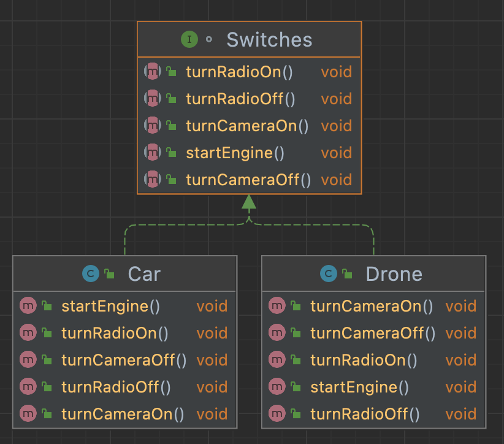
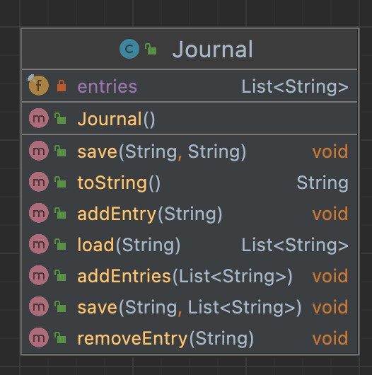
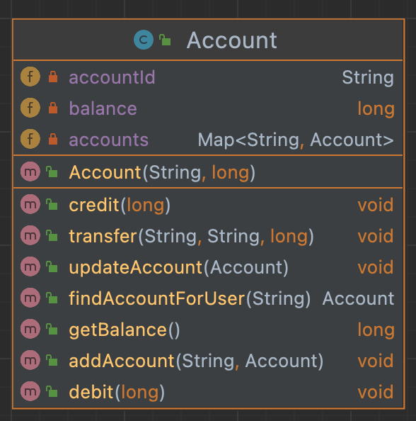

# **LAB 08 TASKS**

## ISP
Two ISP violation diagrams are given.

###### Problem 1
A violation of ISP is given in the following figure.


Apply ISP and write the solution code

###### Problem 2





Apply ISP and write the solution code

## SRP
Code examples are given that violates SRP

###### Example
You are given one example of SRP. Implement the code
```java
public class Employee {
    private String employeeId;
    private String name;
    private String address;
    private Date dateOfJoining;

    public boolean isPromotionDueThisYear() {
        //TODO: promotion logic implementation
        return false;
    }

    public Double calcIncomeTaxForCurrentYear() {
        //TODO: income tax logic implementation
        return 0d;
    }

    //Getters & Setters
}
```
Solution could be
```java
public class Employee {
    private String employeeId;
    private String name;
    private String address;
    private Date dateOfJoining;
    //Getters & Setters
}

public class HRPromotions {
    public boolean isPromotionDueThisYear(Employee emp) {
        //TODO: promotion logic implementation using the employee information passed
        return false;
    }
}

public class FinIncomeTaxCalculation {
    public Double calcIncomeTaxForCurrentYear(Employee emp) {
        //TODO: income tax logic implementation using the employee information passed
        return 0d;
    }
}
```
###### Problem 1
A violation of SRP is given in the following figure.




Apply SRP and write the solution code

###### Problem 2
A violation of SRP is given in the following figure.





Apply SRP and write the solution code
